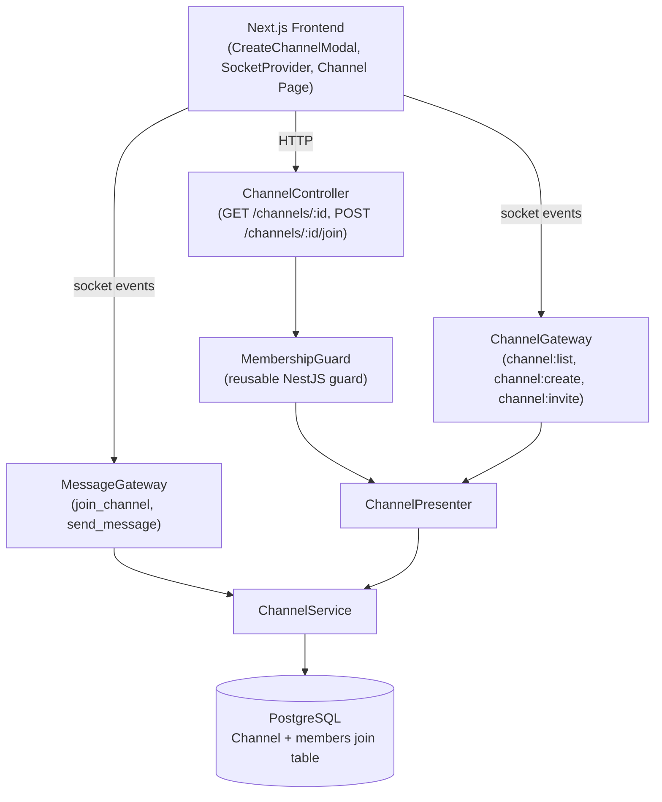

# Design Document: Private Channel Access Control

## Overview

This feature enforces private channel access control across all layers of the application: WebSocket gateways, REST controllers, and the Next.js frontend. The existing data model already has the necessary primitives — `Channel.channelType` (public/private enum) and `Channel.members` (ManyToMany with User) — but no enforcement exists at runtime. The design adds enforcement at every entry point, an invite flow during channel creation, a post-creation invite mechanism, and frontend guards that prevent users from seeing or entering channels they don't belong to.

The approach is additive: no existing entities are restructured. New logic is layered into `ChannelService`, `ChannelPresenter`, `ChannelGateway`, `MessageGateway`, and `ChannelController`, plus a new reusable `MembershipGuard`. The frontend gains a third step in `CreateChannelModal` and a `channel:access_denied` handler.

---

## Architecture



Key design decisions:
- **Membership checks in the service layer** for WebSocket paths (no HTTP context available for guards), and **MembershipGuard** for REST paths where NestJS guards integrate cleanly.
- **Single filtered query** for `channel:list` using a LEFT JOIN so public channels and member-private channels are returned in one round-trip.
- **Invite flow** is a new step 3 in `CreateChannelModal`; the socket payload is extended with `invitedUserIds`.
- **`channel:invite`** is a new WebSocket event for post-creation invites, creator-only.

---

## Components and Interfaces

### Backend

#### ChannelService — new / modified methods

```typescript
// Modified: accepts invitedUserIds, enforces membership on private channels
createChannel(data: {
  name: string;
  workspaceId: string;
  userId: string;
  type: ChannelType;
  invitedUserIds?: string[];
}): Promise<Channel>

// New: filtered list — public OR user is member
getChannelsForUser(workspaceId: string, userId: string): Promise<Channel[]>

// New: add members to an existing private channel (creator only)
inviteMembers(channelId: string, requestingUserId: string, invitedUserIds: string[]): Promise<Channel>

// New: membership check helper used by gateways
isMember(channelId: string, userId: string): Promise<boolean>
```

#### ChannelPresenter — new / modified methods

```typescript
getChannelsForUser(workspaceId: string, userId: string): Promise<Channel[]>
inviteMembers(channelId: string, requestingUserId: string, invitedUserIds: string[]): Promise<Channel>
```

#### ChannelGateway — modified / new event handlers

| Event | Direction | Change |
|---|---|---|
| `channel:list` | client → server | payload gains `userId`; delegates to `getChannelsForUser` |
| `channel:create` | client → server | payload gains `invitedUserIds?` |
| `channel:invite` | client → server | **new** — `{ channelId, invitedUserIds, requestingUserId }` |
| `channel:updated` | server → client | emitted after successful invite |
| `channel:error` | server → client | existing; used for access denied cases |

#### MessageGateway — modified event handlers

| Event | Change |
|---|---|
| `join_channel` | payload gains `userId`; membership check before `client.join()` |
| `send_message` | membership check on private channels before persist/broadcast |

New emitted event: `channel:access_denied` — `{ message: string }`

#### MembershipGuard (new)

```typescript
// be/src/channel/guards/membership.guard.ts
@Injectable()
export class MembershipGuard implements CanActivate {
  // Reads channelId from request params
  // Reads userId from request body or query
  // Calls ChannelService.isMember(); throws ForbiddenException if not a member of a private channel
}
```

Applied to:
- `GET /channels/:id` — returns 403 for non-members of private channels
- `POST /channels/:id/join` — returns 403 for private channels (invitation required)

### Frontend

#### CreateChannelModal — step 3 (new)

When `visibility === 'private'`, a third step is inserted between the visibility step and the create action:

- Fetches workspace members via existing REST/socket API
- Renders a searchable list filtered by `dispname` or `email`
- Maintains `invitedUserIds: string[]` state
- Step indicator updates to "Step 3 of 3"
- `channel:create` payload includes `invitedUserIds`

#### channel:access_denied handler (new)

In the socket event listener setup (SocketProvider or channel page):

```typescript
socket.on('channel:access_denied', ({ message }) => {
  // show toast/notification
  // do NOT update active channel state
});
```

#### Channel page — URL guard (new)

When navigating to `/workspace/[wid]/channel/[cid]`, the page checks if the channel is in the user's filtered channel list. If not, redirect to the workspace default view.

---

## Data Models

No schema changes are required. The existing entities already support the feature:

### Channel entity (existing, no changes)

```typescript
@Entity()
export class Channel {
  @PrimaryGeneratedColumn('uuid') id: string;
  @Column() name: string;
  @ManyToOne(() => Workspace, ...) workspace: Workspace;
  @Column() workspaceId: string;
  @Column({ type: 'enum', enum: ChannelType, default: ChannelType.PUBLIC })
  channelType: ChannelType;
  @Column({ nullable: true }) creatorId: string;
  @ManyToMany(() => User, (user) => user.channels)
  @JoinTable() members: User[];
  @OneToMany(() => Message, ...) messages: Message[];
}
```

### Filtered channel list query

The new `getChannelsForUser` method uses a TypeORM query builder:

```typescript
this.channelRepo
  .createQueryBuilder('channel')
  .leftJoinAndSelect('channel.members', 'member')
  .where('channel.workspaceId = :workspaceId', { workspaceId })
  .andWhere(
    '(channel.channelType = :public OR member.id = :userId)',
    { public: ChannelType.PUBLIC, userId }
  )
  .getMany();
```

### Socket payload extensions

```typescript
// channel:list
{ workspaceId: string; userId: string }

// channel:create
{ workspaceId: string; name: string; type: ChannelType; userId: string; invitedUserIds?: string[] }

// channel:invite (new)
{ channelId: string; invitedUserIds: string[]; requestingUserId: string }

// join_channel (extended)
{ channelId: string; userId: string }

// send_message (existing, senderId already present)
{ channelId: string; senderId: string; content: string; ... }
```


---

## Correctness Properties

*A property is a characteristic or behavior that should hold true across all valid executions of a system — essentially, a formal statement about what the system should do. Properties serve as the bridge between human-readable specifications and machine-verifiable correctness guarantees.*

**Property reflection:** After reviewing all testable criteria, the following consolidations were made:
- 2.1 and 2.2 are two sides of the same membership enforcement rule → combined into Property 2.
- 3.1 and 3.2 are the same rule for message sending → combined into Property 3.
- 4.1 and 4.2 are the same rule for REST GET → combined into Property 4.
- 6.1 and 6.2 are the same creator-only rule → combined into Property 7.
- 5.4 and 6.3 both test "invite then check membership" round-trip → combined into Property 8.
- 1.2 (response shape) is subsumed by Property 1 (which already verifies the returned data).
- 7.4 (userId in payloads) is an implementation detail covered by integration tests.

### Property 1: Channel list visibility filtering

*For any* workspace, any user, and any set of channels (mix of public and private with varying membership), calling `getChannelsForUser` SHALL return exactly the channels where `channelType` is `public` OR the user is present in the channel's `members` relation — no more, no less.

**Validates: Requirements 1.1, 1.2**

---

### Property 2: Private channel join enforcement

*For any* private channel and any user, attempting to join the channel via `join_channel` SHALL succeed (client added to socket room) if and only if the user is a member of that channel. Non-members SHALL receive `channel:access_denied` and SHALL NOT be added to the room.

**Validates: Requirements 2.1, 2.2, 2.3**

---

### Property 3: Private channel message send enforcement

*For any* private channel and any sender, a `send_message` event SHALL result in the message being persisted and broadcast if and only if the sender is a member of that channel. Non-member senders SHALL receive `channel:access_denied` and the message SHALL NOT be persisted or broadcast.

**Validates: Requirements 3.1, 3.2, 3.3**

---

### Property 4: REST membership guard on private channel GET

*For any* private channel and any user, `GET /channels/:id` SHALL return the channel data (HTTP 200) if and only if the user is a member. Non-members SHALL receive HTTP 403. Public channels SHALL always return HTTP 200 regardless of membership.

**Validates: Requirements 4.1, 4.2, 4.3**

---

### Property 5: REST join blocked for private channels

*For any* private channel and any user, `POST /channels/:id/join` SHALL always return HTTP 403 with the message `"Private channels require an invitation"` and SHALL NOT modify the members list.

**Validates: Requirements 4.4**

---

### Property 6: Public channel join via REST is a round-trip

*For any* public channel and any user, calling `POST /channels/:id/join` SHALL add the user to the channel's members list, and a subsequent fetch of the channel SHALL include that user in the members array.

**Validates: Requirements 4.5**

---

### Property 7: Only the creator can invite to a private channel

*For any* private channel and any requesting user, a `channel:invite` event SHALL add the invited users to the channel's members if and only if the requesting user is the channel's creator. Non-creator requests SHALL receive `channel:error` with `"Only the channel creator can invite members"` and the members list SHALL remain unchanged.

**Validates: Requirements 6.1, 6.2, 6.3**

---

### Property 8: Invite members round-trip

*For any* private channel and any set of valid user IDs passed as `invitedUserIds` (either at creation time or via `channel:invite`), all valid users SHALL appear in the channel's `members` relation after the operation. Invalid user IDs SHALL be silently skipped without affecting the valid ones.

**Validates: Requirements 5.4, 5.5, 6.3**

---

### Property 9: Public channel creation ignores invitedUserIds

*For any* `channel:create` event with `type` of `public`, regardless of what `invitedUserIds` is provided, the created channel SHALL have an empty `members` list.

**Validates: Requirements 5.7**

---

### Property 10: Member search filtering

*For any* list of workspace users and any search string, the member search filter in `CreateChannelModal` SHALL return exactly the users whose `dispname` or `email` contains the search string (case-insensitive), and no others.

**Validates: Requirements 5.2**

---

### Property 11: Member list display completeness

*For any* channel with a non-empty `members` array, the rendered member list SHALL include each member's `dispname` and `avatar`, and the `ChannelService` SHALL always return `id`, `dispname`, `email`, and `avatar` on the members relation for any channel fetch operation.

**Validates: Requirements 8.1, 8.3**

---

## Error Handling

| Scenario | Layer | Response |
|---|---|---|
| `userId` absent from `channel:list` payload | ChannelGateway | emit `channel:error` `"userId is required"` |
| Non-member attempts `join_channel` on private channel | MessageGateway | emit `channel:access_denied` `"You are not a member of this channel"` |
| Non-member attempts `send_message` on private channel | MessageGateway | emit `channel:access_denied` `"You are not a member of this channel"` |
| Channel not found on `join_channel` or `send_message` | MessageGateway | emit `channel:access_denied` `"Channel not found"` |
| Non-member `GET /channels/:id` on private channel | MembershipGuard | HTTP 403 `"You are not a member of this channel"` |
| `POST /channels/:id/join` on private channel | MembershipGuard / ChannelController | HTTP 403 `"Private channels require an invitation"` |
| Non-creator `channel:invite` | ChannelGateway | emit `channel:error` `"Only the channel creator can invite members"` |
| `channel:invite` on public channel | ChannelGateway | emit `channel:error` `"Cannot invite members to a public channel"` |
| Invalid user ID in `invitedUserIds` | ChannelService | skip silently, process remaining valid IDs |
| Frontend navigates to private channel URL as non-member | Channel page | redirect to workspace default view |
| `channel:access_denied` received on frontend | SocketProvider / channel page | show non-blocking toast notification; do not update active channel state |

All gateway error emissions use the existing `channel:error` event pattern already established in `ChannelGateway`. The new `channel:access_denied` event is used specifically for access control rejections in `MessageGateway` to allow the frontend to distinguish access errors from general errors.

---

## Testing Strategy

### Unit Tests

Focus on specific examples, edge cases, and error conditions:

- `ChannelService.getChannelsForUser` — verify public channels are always included, private channels only when user is a member, and channels from other workspaces are excluded.
- `ChannelService.createChannel` with `invitedUserIds` — verify creator is always a member, valid invited users are added, invalid IDs are skipped, public channels ignore `invitedUserIds`.
- `ChannelService.inviteMembers` — verify creator-only enforcement, valid users added, invalid IDs skipped.
- `MembershipGuard` — verify 403 for non-members of private channels, 200 for members, 200 for public channels.
- `ChannelController.join` — verify 403 for private channels, success for public channels.
- Member search filter function — verify case-insensitive matching on `dispname` and `email`.

### Property-Based Tests

Using [fast-check](https://github.com/dubzzz/fast-check) (TypeScript/JavaScript PBT library). Each test runs a minimum of 100 iterations.

**Tag format:** `Feature: private-channel-access-control, Property {N}: {property_text}`

| Property | Test description |
|---|---|
| Property 1 | Generate arbitrary channel sets and users; assert `getChannelsForUser` returns exactly public + member-private channels |
| Property 2 | Generate arbitrary private channels and users (member/non-member); assert join succeeds iff member |
| Property 3 | Generate arbitrary private channels and senders; assert message persisted iff sender is member |
| Property 4 | Generate arbitrary channels (public/private) and users; assert GET returns 200 iff public or member |
| Property 5 | Generate arbitrary private channels and users; assert POST /join always returns 403 |
| Property 6 | Generate arbitrary public channels and users; assert POST /join adds user and round-trip fetch confirms membership |
| Property 7 | Generate arbitrary channels and users (creator/non-creator); assert invite succeeds iff creator |
| Property 8 | Generate arbitrary mixes of valid/invalid user IDs; assert only valid ones appear in members after invite |
| Property 9 | Generate arbitrary `invitedUserIds` arrays; assert public channel creation always yields empty members |
| Property 10 | Generate arbitrary user lists and search strings; assert filter returns exactly matching users |
| Property 11 | Generate arbitrary member arrays; assert rendered output contains dispname and avatar for each member |

### Integration Tests

- End-to-end socket flow: create private channel → non-member attempts join → verify `channel:access_denied`
- End-to-end socket flow: create private channel with `invitedUserIds` → invited user joins → verify success
- End-to-end REST flow: `GET /channels/:id` as non-member of private channel → verify 403
- End-to-end invite flow: `channel:invite` as creator → verify `channel:updated` emitted with new member list
